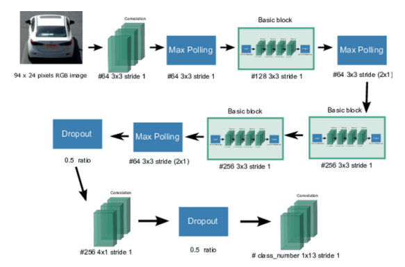
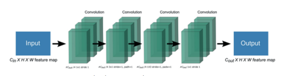
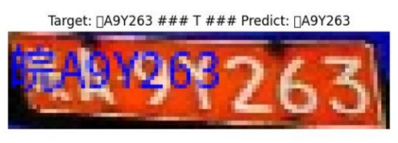
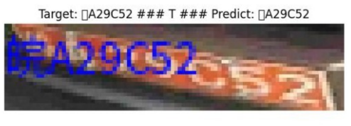
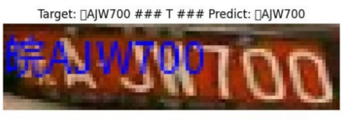

<br />
<div align="center">
    </p>

  <h2 align="center">PBL 4: Deep Learning</h2>
  <h3>Topic: License plate recognition with Deep Neural Networks</h3>
  <hr/>
</div>

## Summary

This topic aims to implement the LPRNet model [1] with the Chinese license plate dataset compiled from the CCPD2020 dataset [2] and the Vietnamese license plate dataset collected through real photos.

## Dataset
#### Chinese license plate dataset: https://github.com/lephamcong/PBL4_LPRNet/tree/main/Dataset/BiensoxeTrungQuoc
#### Vietnamese license plate database: https://github.com/lephamcong/PBL4_LPRNet/tree/main/Dataset/BiensoxeVietNam

## Directory structure

- `Dataset/`: This folder contains the Chinese and Vietnamese license plate datasets.
- `LPRNet_Pytorch_China/`: Contains source code for training and evaluation with the Chinese license plate dataset. 
- `LPRNet_Pytorch_VietNam/`: Contains source code for training and evaluation with the Vietnamese license plate dataset.
- `readme.md`:  this file
- `requirements.txt`: Required library files (instructions for installing the library are below)

## LPRNet Architecture



## Dataset
**Chinese License Plate Dataset**: This dataset is curated from the CCPD2020 collection, which contains approximately 11,776 street-captured images of Chinese license plates. Within the scope of this project, only high-quality samples were selected and enhanced through data augmentation techniques, resulting in a final set of approximately 11,000 images. This data is divided into 10,000 images for training and 1,000 images for evaluation.

**Vietnamese License Plate Dataset**: This dataset was compiled through real-world photography. After selecting high-quality samples and applying various processing and data augmentation techniques, a total of 13,320 Vietnamese license plate images were obtained. The dataset is split into 12,320 images for training and 1,000 images for evaluation purposes.
## Model training
The model training process was conducted in the **Google Colab** environment with the following hardware resource configuration:

* **CPU**: Intel(R) Xeon(R) CPU @ 2.00GHz
* **RAM**: 12GB
* **GPU**: Tesla T4 12GB VRAM

The following table outlines the specific parameters used for training the models on both Chinese and Vietnamese license plate datasets:

| Parameter | Chinese License Plate Data | Vietnamese License Plate Data |
| --- | --- | --- |
| **max epoch** | 150 | 150 |
| **img size** | [94, 24] | [94, 24] |
| **dropout rate** | 0.5 | 0.5 |
| **learning rate** | 0.001 | 0.001 |
| **lpr max len** | 8 | 9 |
| **train batch size** | 32 | 32 |
| **test batch size** | 20 | 20 |
| **momentum** | 0.9 | 0.9 |
| **weight decay** | 2e-5 | 2e-5 |

## Results and evaluation

| Model | Dataset | Mean Accuracy | Mean Levenshtein Distance | Processing Time Per Sample |
| --- | --- | --- | --- | --- |
| **LPRNet** | Chinese license plates with 10,000 training and 1,000 evaluation images | 90% | 0.045 | 9ms |
| **LPRNet** | Vietnamese license plates with 12,320 training and 1,000 evaluation images | 75% | 0.155 | 10ms |
| **Tesseract** | 1,000 Vietnamese license plate images | 84% | 0.22 | 129.8ms |




## How to use source code?

**1. Clone repo:**

```
https://github.com/lephamcong/PBL4_LPRNet.git
```

**2. Install the necessary libraries.:**

```
pip install -r requirements.txt
```
**3. Training and evaluation with the Chinese license plate dataset.**
```
cd LPRNet_Pytorch_China
```
*Training (adjusting the path to the dataset)*
```
python train_LPRNet.py
```
*Evaluation (Results are displayed as the Notebook file LPRNet_Pytorch_China.ipynb)*
```
python test_LPRNet.py
```
**4. Training and evaluation with the Vietnamese license plate dataset.**
```
cd LPRNet_Pytorch_VietNam
```
*Training (adjusting the path to the dataset)*
```
python train_LPRNet.py
```
*Evaluation (Results are displayed as the Notebook file LPRNet_Pytorch_VietNam.ipynb)*
```
python test_LPRNet.py
```
## References
[1] Zherzdev, Sergey, and Alexey Gruzdev. "Lprnet: License plate recognition via deep neural networks." arXiv preprint arXiv:1806.10447 (2018).

[2] Xu, Zhenbo, et al.“Towards end-to-end license plate detection and recogni-
tion: A large dataset and baseline." Proceedings of the European conference on
computer vision (ECCV). 2018

[3] https://github.com/lyl8213/Plate_Recognition-LPRnet

[4] https://github.com/mesakarghm/LPRNET

[5] https://github.com/xuexingyu24/License_Plate_Detection_Pytorch.git

### Contact information: lephamcong.bk@gmail.com


